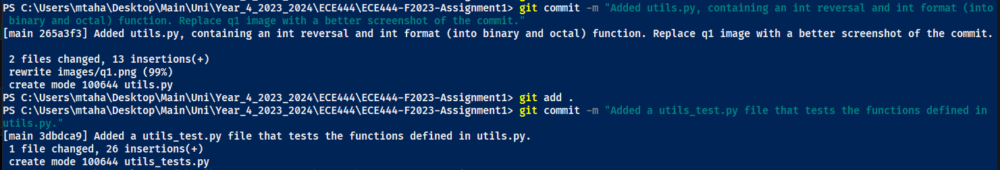

# Taha Khokhar
### Activity 1: Creation of repo, initial commit

### Activity 2: Hello World program

### Activity 3: Fixing merge conflict between 'main' and 'develop'

### Activity 4: Creating and testing utils functions

### Activity 5: Rebasing and Reording Commits

#### Initial Rebase Command

#### Interactive Rebase to Reorder Commits

#### Interactive Rebase (Before Reordering)

#### Interactive Rebase (After Reordering)

